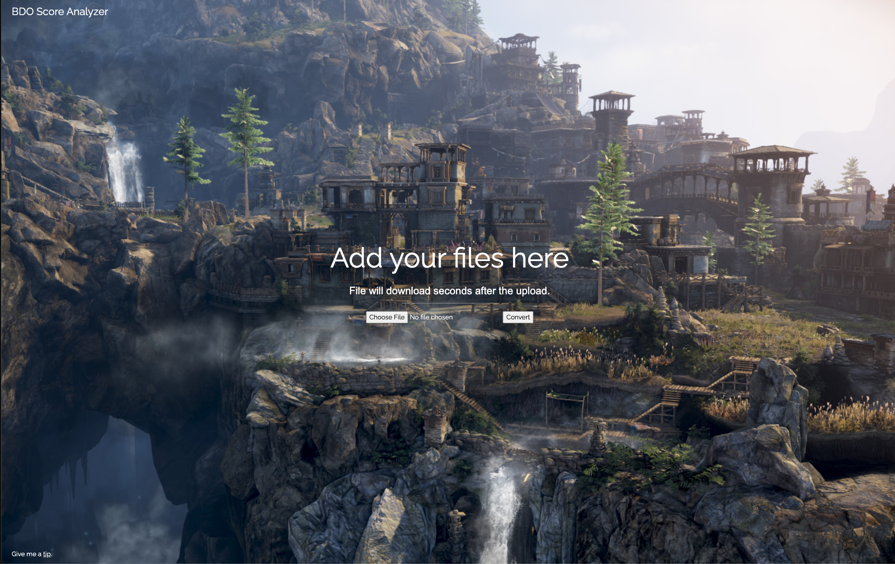

<p align="center">
</p>
<h1 align="center">BDO Score Analyzer</h1>
<p align="center">A Black Desert OCR for war scores</p>
<p align="center"><a href="http://scores.nstlopez.com">Check it out !</a></p>
<div align="center">

[](https://github.com/nsttt/BDOScoreAnalyzer/compare/) [](https://github.com/Nsttt/BDOScoreAnalyzer/issues) [](https://github.com/Nsttt/BDOScoreAnalyzer/blob/master/LICENSE.txt)

</div>
<p align="center">
  <a href="http://scores.nstlopez.com">
    
  </a>
</p>

<br>

A very basic OCR for Black Desert Online war scores. It takes a screenshot of your scores and prints it out as a `.pdf` that you can copy/paste data from.

### ⏳ Local Installation

Create a `uploads` folder in the root directory.

Install all required dependencies with this command:

- You can use `npm` if you like, but I highly recomend you stick with `yarn`.

```bash
yarn install
```

## License

See the [LICENSE](./LICENSE) file for licensing information.

---
